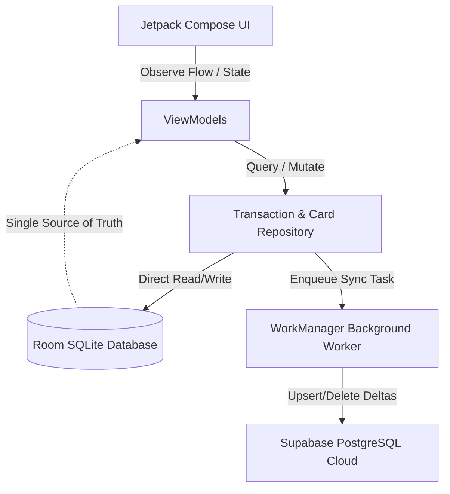

# ExlExp Native Android (Kotlin + Jetpack Compose) Architecture Specification

This document is the **definitive, exhaustive engineering blueprint** for building the native Android version of **ExlExp** (Excel-style Personal Finance & Expense Tracker). It captures 100% of the domain models, business logic, mathematical rules, database schemas, heuristics, API contracts, and UI specifications from the existing codebase.

Any AI agent or developer reading this specification has all the context necessary to implement the entire application from scratch in a new Android project without ambiguity.

---

## Table of Contents
1. [Product Overview & Architectural Goals](#1-product-overview--architectural-goals)
2. [Target Tech Stack & Recommended Architecture](#2-target-tech-stack--recommended-architecture)
3. [Database Schema & Domain Models](#3-database-schema--domain-models)
4. [Core Business Logic & Mathematical Formulas](#4-core-business-logic--mathematical-formulas)
   - [Account Classifications & Balances](#account-classifications--balances)
   - [Credit Card Lifetime Stats & Credit Age](#credit-card-lifetime-stats--credit-age)
   - [Zelle Heuristics & Form Formatting](#zelle-heuristics--form-formatting)
   - [Dual-Leg Transfer Engine](#dual-leg-transfer-engine)
   - [Transfer Consolidation for Display](#transfer-consolidation-for-display)
   - [12-Month Rolling Trend & Category Distribution](#12-month-rolling-trend--category-distribution)
5. [Cloud Synchronization & Offline-First Strategy](#5-cloud-synchronization--offline-first-strategy)
6. [Screen-by-Screen UI & Component Specification](#6-screen-by-screen-ui--component-specification)
7. [Directory Structure & Project Setup](#7-directory-structure--project-setup)
8. [Summary for the Antigravity Agent](#8-summary-for-the-antigravity-agent)

---

## 1. Product Overview & Architectural Goals

**ExlExp** is a personal finance tracker inspired by the density, precision, and clarity of spreadsheets (Excel / Google Sheets). Unlike conventional consumer finance apps that hide numbers behind oversized cards, ExlExp delivers dense, spreadsheet-style registries with instant calculations.

### Key Pain Points of the React Native Version (Solved by Native Android)
- **Dataset Size**: Users log over 6,500+ transactions. Storing this as a single JSON blob in memory or `AsyncStorage` causes UI stutter.
- **Goal in Native Android**: 
  - **Single Source of Truth**: Room SQLite database with disk-backed B-Trees.
  - **Memory Efficiency**: Paged cursor loading (`Paging 3`) so only 15–20 visible items reside in memory at once.
  - **Fluidity**: Hardware-accelerated 60/120 FPS rendering on Jetpack Compose with zero JavaScript bridge overhead.
  - **Instant Queries**: Heavy aggregations (sums, 12-month trends, category groupings) executed in compiled native C SQLite in `< 5ms`.

---

## 2. Target Tech Stack & Recommended Architecture

| Layer | Technology |
| :--- | :--- |
| **Language** | Kotlin 2.0+ (100% Kotlin, Coroutines, Flow) |
| **UI Toolkit** | Jetpack Compose (Material 3) |
| **Architecture** | Clean Architecture / MVI (Model-View-Intent) or MVVM with `StateFlow` |
| **Local Database** | Room Database (SQLite with WAL mode enabled) |
| **Pagination** | Jetpack Paging 3 (`PagingSource`, `LazyPagingItems`) |
| **Dependency Injection** | Hilt or Koin |
| **Network & Backend** | Supabase Kotlin SDK (`postgrest-kt`, `gotrue-kt`) or Ktor Client |
| **Background Sync** | WorkManager (periodic and on-demand background delta sync) |
| **Min SDK / Target SDK** | Min SDK 26 (Android 8.0) / Target SDK 34/35 |

---

## 3. Database Schema & Domain Models

### Supabase Cloud Backend Details
- **Supabase URL**: `https://vpwkzljngftfuyatqjzi.supabase.co`
- **Supabase Anon Key**: `sb_publishable_DsezTQetaxTLqNLqrvl4sQ_c8nTnTmC`

---

### Entity 1: `CreditCardEntity` / `Account`
Represents both physical credit cards and bank/investment accounts.

```kotlin
@Entity(tableName = "cards")
data class CreditCardEntity(
    @PrimaryKey
    val id: String,                         // e.g. "card-chase", "acc-checking-default"
    val name: String,                       // e.g. "Chase Freedom", "Santander Checking"
    val isChecking: Boolean = false,        // True if Checking account
    val isSaving: Boolean = false,          // True if High-Yield Savings account
    val isBrokerage: Boolean = false,       // True if Investment/Brokerage account
    val isHidden: Boolean = false,          // If true, hidden from selector dropdowns
    val priority: Int = 0,                  // Custom user ordering priority
    val openDate: String,                   // Account opening date (YYYY-MM-DD)
    val username: String = "local",         // Multi-user isolation key
    val isSyncDirty: Boolean = false,       // Local change pending cloud sync
    val updatedAt: Long = System.currentTimeMillis()
)
```

#### Account Type Rules:
- **Deposit Group**: Any account where `isChecking || isSaving || isBrokerage == true`.
- **Credit Card**: Any account where `!isChecking && !isSaving && !isBrokerage`.
- **Known Checking IDs**: Account IDs containing `card-chase`, `card-santander`, `card-sofi`, `card-upgrade`, `card-citizens`, or `checking`.

#### Default Local Accounts (First Launch / Guest Mode):
1. `id: "acc-checking-default"`, `name: "Cash / Checking"`, `isChecking: true`, `priority: 0`, `openDate: today`
2. `id: "card-credit-default"`, `name: "Primary Credit Card"`, `isChecking: false`, `priority: 1`, `openDate: today`

---

### Entity 2: `ExpenseEntity` / `Transaction`
Represents an individual financial transaction or transfer leg.

```kotlin
@Entity(
    tableName = "expenses",
    indices = [
        Index("creditCardId"),
        Index("date"),
        Index("username"),
        Index("category"),
        Index("transferLinkId")
    ]
)
data class ExpenseEntity(
    @PrimaryKey
    val id: String,                         // e.g. "exp-abc123xyz"
    val description: String,                // Merchant or transaction description
    val amount: Double,                     // Signed numeric amount (see rules below)
    val creditCardId: String,               // Foreign key referencing cards.id
    val date: String,                       // ISO date (YYYY-MM-DD)
    val fromTo: String? = null,             // Payee/Payer for checking/savings accounts
    val details: String? = null,            // Additional notes, Zelle info, bill pay note
    val isFee: Boolean = false,             // True if Annual Fee or Account Fee
    val isReward: Boolean = false,          // True if Cashback / Reward redemption
    val rewardType: String? = null,         // "cashback" | "other" (miles/points)
    val rewardValue: Double? = null,        // Reward value in dollars or points
    val isTransfer: Boolean = false,        // True if this is an inter-account transfer
    val transferLinkId: String? = null,     // Shared GUID linking two transfer legs
    val isInterest: Boolean = false,        // True if HYSA Interest earned
    val category: String = "Others",        // Standardized category
    val username: String = "local",         // User identifier
    val isSyncDirty: Boolean = false,
    val updatedAt: Long = System.currentTimeMillis()
)
```

---

### Entity 3: `FutureExpenseEntity` / `ScheduledBill`
Represents upcoming bills or planned expenses shown on the Dashboard.

```kotlin
@Entity(tableName = "future_expenses")
data class FutureExpenseEntity(
    @PrimaryKey
    val id: String,                         // e.g. "fut-abc123"
    val description: String,                // e.g. "Car Insurance Premium"
    val amount: Double,                     // Dollar amount
    val dueDate: String? = null,            // Optional ISO date (YYYY-MM-DD)
    val username: String = "local",
    val isSyncDirty: Boolean = false
)
```

---

## 4. Core Business Logic & Mathematical Formulas

### Account Classifications & Balances

#### 1. Deposit Accounts (Checking, Savings, Brokerage)
- **Positive Amount (`+`)**: Money deposited / received (Income, Refunds, Interest, Incoming Transfer).
- **Negative Amount (`-`)**: Money withdrawn / spent (Bills paid, Outgoing Transfer, Cash withdrawal).
- **Current Account Balance**:
  $$\text{Account Balance} = \sum_{e \in \text{Transactions}} e.\text{amount}$$
- **Total Checking / Liquid Assets**: Sum of balances of all accounts where `isChecking == true`.
- **Total Brokerage Balance**: Sum of balances of all accounts where `isBrokerage == true`.

#### 2. Credit Cards (Liability / Debt)
- **Positive Amount (`+`)**: Charge / Expense / Annual Fee (Increases debt owed).
- **Negative Amount (`-`)**: Payment / Statement Credit / Refund (Reduces debt owed).
- **Current Balance Due**:
  $$\text{Balance Due} = \sum e.\text{amount}$$
- **Total Credit Card Debt**:
  $$\text{Total Debt} = \sum_{\text{all credit cards}} \max(0.0, \text{Card Balance Due})$$

#### 3. Net Financial Position (Dashboard KPI)
$$\text{Net Balance} = \text{Total Checking Balance} - \text{Total Credit Card Debt} - \sum \text{Future Expenses}$$

---

### Credit Card Lifetime Stats & Credit Age

For each individual credit card in the Credit Cards Hub:

1. **Spent**: Sum of all positive standard charges ($e.\text{amount} > 0$) + Annual Fees ($e.\text{isFee} == \text{true}$). Excludes rewards.
2. **Paid**: Sum of all payments ($e.\text{amount} < 0$) + cashback statement credits.
3. **Rewards**: Sum of $e.\text{rewardValue}$ where $e.\text{isReward} == \text{true}$.
4. **Fees**: Sum of $e.\text{amount}$ where $e.\text{isFee} == \text{true}$ or category is `Fee`/`Annual Fee`.
5. **Balance Due**: $\text{Spent} - \text{Paid}$.

#### Closed Card Detection
A card is considered **Closed** if its name contains `"closed"` or `"close"` (case-insensitive), e.g., `"Discover It (Closed)"`.

#### Individual Credit Age Calculation
Given `openDate` in `YYYY-MM-DD`:
```kotlin
fun calculateCreditAge(openDateStr: String?): CreditAge {
    if (openDateStr.isNullOrBlank() || !openDateStr.matches(Regex("""^\d{4}-\d{2}-\d{2}$"""))) {
        return CreditAge(0, 0, 0, "0 mos")
    }
    val parts = openDateStr.split("-").map { it.toInt() }
    val open = LocalDate.of(parts[0], parts[1], parts[2])
    val now = LocalDate.now()
    if (open.isAfter(now)) return CreditAge(0, 0, 0, "0 mos")

    val period = Period.between(open, now)
    val totalMonths = period.years * 12 + period.months
    val years = totalMonths / 12
    val months = totalMonths % 12

    val formatted = when {
        years > 0 && months > 0 -> "$years yr${if (years > 1) "s" else ""} $months mo${if (months > 1) "s" else ""}"
        years > 0 -> "$years yr${if (years > 1) "s" else ""}"
        else -> "$months mo${if (months > 1) "s" else ""}"
    }
    return CreditAge(years, months, totalMonths, formatted)
}
```

#### Average Credit Age (Dashboard & Overview KPI)
Calculated strictly across **open cards** (closed cards are excluded from the average):
$$\text{Average Months} = \frac{\sum_{c \in \text{Open Cards}} c.\text{totalMonths}}{|\text{Open Cards}|}$$
Format as `X yrs Y mos` or `Y mos`. If no open cards exist, display `"N/A"`.

---

### Zelle Heuristics & Form Formatting

When logging a Checking or Savings transaction with Zelle:
- User selects **From** (Money Received / Inflow) or **To** (Money Sent / Outflow).
- **Zelle Name**: e.g., `"John Doe"`.
- **Zelle Notes / Memo**: e.g., `"Dinner split"`.
- **Generated Fields**:
  - `fromTo = "Zelle"`
  - `details = "Zelle <To|From> <Name> (<Notes>)"` (if notes present) or `"Zelle <To|From> <Name>"`
  - `description = "Zelle <To|From> <Name>"`
  - If `fromOrTo == "From"`: Amount is **positive** ($+X$).
  - If `fromOrTo == "To"`: Amount is **negative** ($-X$).

#### Reverse Parsing Regex (for editing existing transactions):
```kotlin
val zelleRegexWithMemo = Regex("""^Zelle (To|From) (.+?) \((.*?)\)$""")
val zelleRegexSimple = Regex("""^Zelle (To|From) (.+)$""")
```

---

### Dual-Leg Transfer Engine

An inter-account transfer always creates **two separate, linked records** in the `expenses` table sharing a single `transferLinkId` (`"tr-" + UUID`):

1. **Source Account (Sender)**:
   - `creditCardId = sourceAccountId`
   - `amount = -abs(parsedAmount)` (Money leaving source)
   - `description = "Transfer to <TargetAccountName>"`
   - `fromTo = targetAccountName`
   - `category = "Transfer"`
   - `isTransfer = true`
   - `details = if (isCcBillPay) "Credit Card Bill Pay - <TargetName>" else transferMemo`

2. **Target Account (Receiver)**:
   - `creditCardId = targetAccountId`
   - `amount = if (targetIsDeposit) +abs(parsedAmount) else -abs(parsedAmount)` 
     *(Note: For credit cards, paying a bill is a negative amount because it reduces debt owed!)*
   - `description = "Transfer from <SourceAccountName>"`
   - `fromTo = sourceAccountName`
   - `category = "Transfer"`
   - `isTransfer = true`
   - `details = same as source`

---

### Transfer Consolidation for Display

When rendering master transaction feeds (such as the **Dashboard Recent Transactions** or the **All Transactions Page**):
- Showing both legs of a transfer is redundant and clutters the feed.
- **Rule**: Only show the outgoing money leg (the sender). Exclude the incoming money leg.

```kotlin
fun isIncomingTransfer(item: ExpenseEntity): Boolean {
    val isTransfer = item.isTransfer || item.category.equals("Transfer", ignoreCase = true)
    if (!isTransfer) return false

    val desc = item.description.lowercase()
    if (desc.startsWith("transfer from")) return true

    // On deposit accounts, positive transfer amount is money received
    if (item.amount > 0) return true

    return false
}
```

---

### 12-Month Rolling Trend & Category Distribution

#### Rolling 12-Month Window
Includes the current calendar month plus the previous 11 calendar months:
- Month Key format: `YYYY-MM` (e.g. `2026-09`, `2026-08`, ..., `2025-10`).
- Display label: Short month name (`Sep`, `Aug`) + 2-digit year (`'26`).

#### Calculation Rules (Single Pass over transactions):
1. **Exclude Transfers**: Skip if `isTransfer == true` or `category == "Transfer"`.
2. **Exclude Income / Salary**: Skip if `category == "Salary"`.
3. **Determine Spending Contribution**:
   - For Deposit Accounts:
     - If `amount < 0` and `!isInterest`: `spending = abs(amount)`.
     - If `amount > 0`: `spending = -amount` (refund reducing spend).
   - For Credit Cards:
     - If `amount > 0` and `!isReward`: `spending = amount`.
     - If `amount < 0`: `spending = amount` (refund reducing spend).
4. **Metrics**:
   - Monthly Total: Sum of spending for each month.
   - 12-Month Grand Total: $\sum_{i=1}^{12} \text{MonthlyTotal}_i$.
   - Monthly Average: $\text{Grand Total} / 12$.
   - Max Monthly Spend: Used to scale the vertical bar chart height.

#### Standard Category Palette & Deterministic Colors
Categories supported:
- `Rent` / `Housing`: `#6366f1` (Indigo)
- `Utilities` / `Utility` / `Bills`: `#0284c7` (Sky Blue)
- `Car Payment` / `Transportation` / `Transport`: `#8b5cf6` (Purple)
- `Gas`: `#ec4899` (Pink)
- `Grocery` / `Groceries` / `Grocery / Food`: `#10b981` (Emerald)
- `Food` / `Eating Out` / `Dining` / `Restaurant`: `#f59e0b` (Amber)
- `Necessary Purchases`: `#14b8a6` (Teal)
- `Luxury Purchases` / `Shopping`: `#ec4899` (Pink)
- `Entertainment`: `#f97316` (Orange)
- `Subscriptions`: `#a855f7` (Violet)
- `Health` / `Medical`: `#ef4444` (Red)
- `Travel`: `#06b6d4` (Cyan)
- `Fee` / `Annual Fee`: `#b45309` (Amber Brown)
- `Others`: `#64748b` (Slate Gray)
- `Salary`: `#16a34a` (Green)
- `Transfer`: `#3b82f6` (Blue)

If an unrecognized category is encountered, compute a deterministic hash of the name string modulo the 13-color palette so the color never changes across screens.

---

## 5. Cloud Synchronization & Offline-First Strategy



### Delta Sync Rules
1. **Offline-First**: All writes happen to Room SQLite first with `isSyncDirty = true`. The UI updates in **0 ms**.
2. **Delta Sync to Cloud**:
   - Filter all entities where `isSyncDirty == true`.
   - Batch upsert to Supabase in chunks of 100 rows.
   - For deleted items, store deleted IDs in a `deleted_records` tombstone table and execute `.delete().in("id", chunk)`.
   - Upon successful network response, set `isSyncDirty = false`.
3. **Guest / Local Mode**: If `username == "local"`, cloud sync is bypassed completely.

---

## 6. Screen-by-Screen UI & Component Specification

The native Android app features **4 Bottom Navigation Tabs** + **1 Floating Action Button (FAB)**:

```
┌─────────────────────────────────────────────────────────┐
│ Top Bar: ExlExp                                         │
├─────────────────────────────────────────────────────────┤
│                                                         │
│                                                         │
│                   Screen Content Area                   │
│                                                         │
│                                                         │
├─────────────────────────────────────────────────────────┤
│        [➕ Floating Log Expense Button (FAB)]           │
├─────────────────────────────────────────────────────────┤
│ [📊 Analytics] [🏛️ Accounts] [💳 Cards] [⚙️ Settings] │
└─────────────────────────────────────────────────────────┘
```

---

### Tab 1: Analytics (Dashboard Screen)

1. **KPI Header**:
   - **Net Balance**: Large bold headline. Green if positive, red if negative.
   - **Checking Balance**: Total liquid cash in checking accounts.
   - **Total Credit Card Debt**: Total outstanding balances owed.
   - **Future Bills Total**: Total scheduled upcoming expenses.
2. **Scheduled / Future Expenses Card**:
   - Compact table listing description, amount, due date.
   - Quick "Add Future Bill" inline row.
   - Swipe-to-delete or delete button.
3. **12-Month Spending Trend Bar Chart**:
   - Horizontal row of 12 vertical bars (oldest to newest).
   - Tapping a bar selects that month and updates the Category Wheel below.
   - Displays 12-Month Total and Monthly Average above the chart.
4. **Category Distribution Wheel & Breakdown**:
   - Donut Chart drawing arc segments proportional to category spending for the active month.
   - Center of donut displays total spending for that month.
   - List of categories below with colored progress bars, dollar amounts, and percentage shares.
5. **Recent Transactions (Last 10)**:
   - **Line 1**: `Date` (`fontSize 11`, gray `#64748b`) + `Description` (`fontSize 13`, black `#000000`) + `Amount` (`fontSize 13`, bold, colored).
   - **Line 2**: Indented spacer under date + `Account / Card Name` (`fontSize 10`, bold, `#5d5d5d`).
   - "Show All Transactions →" button at bottom navigating to `AllTransactionsPage`.
6. **Active Checking & Credit Card Summaries**:
   - Quick spreadsheet-style glance at cards and accounts with active non-zero balances.

---

### Tab 2: Accounts (Checking, Savings, Brokerage Hub)

1. **Top Horizontal Sub-Tabs (Excel Sheet Tabs)**:
   - Sub-tabs for each Checking account, Savings account, and a `"Brokerage Portfolio"` tab.
2. **Account Banner**:
   - Selected Account Name and large Current Balance.
3. **Spreadsheet Table**:
   - Horizontal scrolling container + vertical virtualized list (`LazyColumn`).
   - Columns: `Date`, `From/To`, `Amount`, `Details`, `Category`, `Actions (Edit, Delete)`.
   - Savings accounts include an extra `Interest` column where interest amounts are highlighted in green.
   - Brokerage tab displays a list of investment accounts with quick inline balance editing.

---

### Tab 3: Credit Cards Hub

1. **Master Overview Sub-Tab (`Overview / All`)**:
   - Summary Cards: Average Credit Age, Total Open Cards, Total Closed Cards, Total Debt Due, Total Lifetime Spent, Payments Made, Rewards Earned, Annual Fees Paid.
   - Master Table: Each card listed with Opening Date, Credit Age, Spend, Paid, Rewards, Fees, and Due balance.
   - Quick date-picker modal to edit a card's opening date.
2. **Individual Card Sub-Tabs**:
   - Dedicated transaction sheet for the selected card.
   - Columns: `Date`, `Description`, `Spend`, `Paid`, `Rewards`, `Category`, `Actions`.

---

### Tab 4: Settings & Customization

1. **Account Management**:
   - Add new Credit Cards, Checking, Savings, or Brokerage accounts.
   - Reorder accounts (up/down priority buttons).
   - Rename accounts, toggle visibility (hidden/visible), or delete accounts.
2. **Cloud Sync & User Management**:
   - Cloud user login / registration via Supabase.
   - "Sync Now" button with timestamp of last sync.
   - Update username and update password dialogues.
   - Export all data as structured JSON backup.

---

### Floating Modal: Log Expense / Transfer (FAB)

Toggle between two distinct modes:
1. **Transaction Mode**:
   - Account Selector: Visual chips for all non-hidden cards and bank accounts.
   - Amount Input: Large numeric keypad input.
   - Date Selector: Defaults to today, quick "Yesterday" button, or date picker.
   - If Checking/Savings selected:
     - Toggle between **From** (Money In) and **To** (Money Out).
     - Checkbox for **Zelle** (reveals Zelle Name + Memo inputs).
     - Checkbox for **Interest** (for Savings accounts).
   - If Credit Card selected:
     - Description / Merchant input.
     - Checkbox for **Annual Fee** / **Reward (Cashback Credit)**.
   - Category selector dropdown.
   - "Stay on page to log multiple" toggle.
2. **Transfer Mode**:
   - **Source Account** dropdown (Checking / Savings).
   - **Target Account** dropdown (Other Bank Account or Credit Card).
   - Amount and Date inputs.
   - Checkbox for **Credit Card Bill Pay** (auto-populates details as `"Credit Card Bill Pay - <CardName>"`).
   - Submit creates both linked transactions simultaneously.

---

### Dedicated Screen: All Transactions Page

Opened from the Dashboard "Show All Transactions →":
1. **Search Bar**: Debounced text search matching description, account name, amount, or date.
2. **Filter Pills**: `All`, `Bank & Invest`, `Credit Cards`, `Transfers`.
3. **Virtualized Transaction List (`LazyColumn` with Paging 3)**:
   - **Line 1**: `Date` (`11sp`, `#64748b`) + `Description` (`13sp`, `#000000`) + `Amount` (`13sp`, bold, colored) + Edit/Delete buttons.
   - **Line 2**: Indented space + `Account Name & Icon` (`10sp`, bold, `#5d5d5d`).

---

## 7. Directory Structure & Project Setup

When setting up the new native Android repository, use this standard clean package structure:

```
app/src/main/java/com/muyeedahmed/exlexp/
├── data/
│   ├── local/
│   │   ├── AppDatabase.kt
│   │   ├── dao/
│   │   │   ├── ExpenseDao.kt
│   │   │   ├── CardDao.kt
│   │   │   └── FutureExpenseDao.kt
│   │   └── entity/
│   │       ├── ExpenseEntity.kt
│   │       ├── CreditCardEntity.kt
│   │       └── FutureExpenseEntity.kt
│   ├── remote/
│   │   ├── SupabaseClient.kt
│   │   └── dto/
│   ├── repository/
│   │   ├── ExpenseRepositoryImpl.kt
│   │   ├── CardRepositoryImpl.kt
│   │   └── SyncRepositoryImpl.kt
│   └── worker/
│       └── CloudSyncWorker.kt
├── domain/
│   ├── model/
│   │   ├── Expense.kt
│   │   ├── CreditCard.kt
│   │   ├── DisplayTransaction.kt
│   │   └── SpendingTrend.kt
│   ├── repository/
│   │   ├── ExpenseRepository.kt
│   │   └── CardRepository.kt
│   └── usecase/
│       ├── CalculateBalancesUseCase.kt
│       ├── CalculateCreditAgeUseCase.kt
│       ├── CalculateRollingTrendUseCase.kt
│       ├── ConsolidateTransfersUseCase.kt
│       └── ParseZelleDetailsUseCase.kt
├── ui/
│   ├── theme/
│   │   ├── Color.kt
│   │   ├── Type.kt
│   │   └── Theme.kt
│   ├── navigation/
│   │   ├── Screen.kt
│   │   └── AppNavHost.kt
│   ├── components/
│   │   ├── TransactionRowItem.kt
│   │   ├── CategoryDonutChart.kt
│   │   ├── TrendBarChart.kt
│   │   └── AccountBadge.kt
│   └── screens/
│       ├── dashboard/
│       │   ├── DashboardScreen.kt
│       │   └── DashboardViewModel.kt
│       ├── accounts/
│       │   ├── AccountsScreen.kt
│       │   └── AccountsViewModel.kt
│       ├── creditcards/
│       │   ├── CreditCardsScreen.kt
│       │   └── CreditCardsViewModel.kt
│       ├── logexpense/
│       │   ├── LogExpenseModal.kt
│       │   └── LogExpenseViewModel.kt
│       ├── alltransactions/
│       │   ├── AllTransactionsScreen.kt
│       │   └── AllTransactionsViewModel.kt
│       └── settings/
│           ├── SettingsScreen.kt
│           └── SettingsViewModel.kt
└── ExlExpApp.kt
```

### Essential Gradle Dependencies (`app/build.gradle.kts`)
```kotlin
dependencies {
    // Jetpack Compose & Material 3
    implementation(platform("androidx.compose:compose-bom:2024.08.00"))
    implementation("androidx.compose.ui:ui")
    implementation("androidx.compose.material3:material3")
    implementation("androidx.compose.ui:ui-tooling-preview")
    implementation("androidx.navigation:navigation-compose:2.8.0")

    // Room Database
    implementation("androidx.room:room-runtime:2.6.1")
    implementation("androidx.room:room-ktx:2.6.1")
    implementation("androidx.room:room-paging:2.6.1")
    ksp("androidx.room:room-compiler:2.6.1")

    // Paging 3
    implementation("androidx.paging:paging-runtime-ktx:3.3.2")
    implementation("androidx.paging:paging-compose:3.3.2")

    // Lifecycle & Coroutines
    implementation("androidx.lifecycle:lifecycle-viewmodel-compose:2.8.5")
    implementation("org.jetbrains.kotlinx:kotlinx-coroutines-android:1.8.1")

    // Supabase Kotlin Client
    implementation(platform("io.github.jan-tennert.supabase:bom:2.6.0"))
    implementation("io.github.jan-tennert.supabase:postgrest-kt")
    implementation("io.github.jan-tennert.supabase:gotrue-kt")
    implementation("io.ktor:ktor-client-android:2.3.12")

    // WorkManager
    implementation("androidx.work:work-runtime-ktx:2.9.1")

    // Dependency Injection (Hilt)
    implementation("com.google.dagger:hilt-android:2.51.1")
    ksp("com.google.dagger:hilt-compiler:2.51.1")
    implementation("androidx.hilt:hilt-navigation-compose:1.2.0")
}
```

---

## 8. Summary for the Antigravity Agent

When you start the new native Android project:
1. Initialize the project with the package name `com.muyeedahmed.exlexp`.
2. Reference this document (`NATIVE_ANDROID_ARCHITECTURE_SPEC.md`) directly.
3. Build the Room Entities and DAOs first, ensuring `Room.databaseBuilder` is set up with WAL mode enabled.
4. Implement the Use Cases for transfer consolidation, balance calculations, and credit age.
5. Construct the Jetpack Compose screens matching the layouts and color palettes specified in Section 6.
6. Connect Supabase background synchronization using WorkManager.

